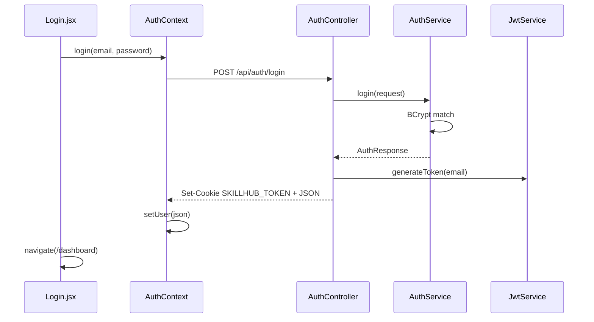
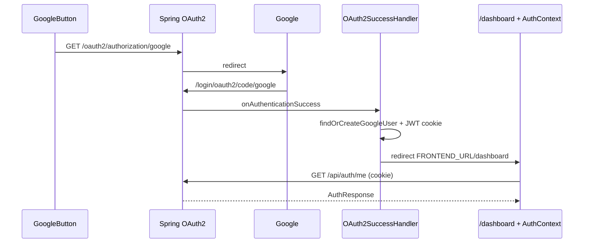

# SkillHub authentication — how the files work together

This folder explains login, register, JWT cookies, and Google OAuth.

- [02-backend.md](./02-backend.md) — Spring Security, JWT, OAuth handlers
- [03-frontend.md](./03-frontend.md) — React screens, `AuthContext`, axios

## Who does what

```
Browser (Vercel / localhost:5173)
    │
    │  email login: POST /api/auth/login   (JSON + cookie)
    │  Google:      GET  {api}/oauth2/authorization/google
    │
    ▼
Spring Boot (Render / localhost:8080)
    │
    ├── AuthController     password register / login / me / logout
    ├── AuthService        hash password, find/create user
    ├── JwtService         sign and verify JWT
    ├── JwtAuthenticationFilter   attach user to each request
    ├── OAuth2SuccessHandler      after Google → cookie + redirect
    └── SecurityConfig     which URLs are public
```

## Two login paths

### A. Email and password

1. `Login.jsx` calls `useAuth().login()`.
2. `AuthContext` calls `authService.loginUser()`.
3. `axiosClient` `POST`s to `/api/auth/login` with `withCredentials: true`.
4. `AuthController` → `AuthService.login()` checks BCrypt password.
5. `JwtService` creates a JWT (subject = email).
6. Controller sets HttpOnly cookie `SKILLHUB_TOKEN`.
7. Frontend stores the user JSON in React state (not the token).
8. Later requests send the cookie. Filter reads it and loads the user.

### B. Google OAuth

1. `GoogleButton` → `loginWithGoogle()` → full page to `{apiBaseUrl}/oauth2/authorization/google`.
2. Spring redirects to Google. User signs in.
3. Google returns to `{backend}/login/oauth2/code/google`.
4. `OAuth2SuccessHandler` reads email/name/`sub`/picture.
5. `AuthService.findOrCreateGoogleUser()` saves `AuthProvider.GOOGLE`.
6. JWT cookie is set. Browser is redirected to `{FRONTEND_URL}/dashboard`.
7. `AuthProvider` mounts, calls `/api/auth/me` with the cookie, fills `user`.

## Session model

| Piece | Where | Purpose |
|---|---|---|
| `SKILLHUB_TOKEN` cookie | Browser, HttpOnly | JWT. JS cannot read it (XSS-safe). |
| `AuthResponse` JSON | React `user` state | Name, email, role, skills for the UI. |
| Spring `SecurityContext` | One HTTP request | Set by `JwtAuthenticationFilter`. |

Production cookie flags: `Secure` + `SameSite=None` when `FRONTEND_URL` is `https://…` so Vercel can send the cookie to Render.

## File map

### Backend

| File | Job |
|---|---|
| `auth/controller/AuthController.java` | HTTP API for password auth |
| `auth/service/AuthService.java` | Register, login, Google user upsert, `toResponse` |
| `auth/service/OAuth2Service.java` | Thin wrapper around Google upsert |
| `auth/security/OAuth2SuccessHandler.java` | After Google: cookie + redirect |
| `auth/security/JwtService.java` | Create / parse / validate JWT |
| `auth/security/JwtAuthenticationFilter.java` | Bearer header or cookie → SecurityContext |
| `auth/security/CustomUserDetailsService.java` | Load user + `ROLE_*` for Spring |
| `auth/dto/LoginRequest.java` | Login JSON |
| `auth/dto/RegisterRequest.java` | Register JSON |
| `auth/dto/AuthResponse.java` | User JSON returned to the client |
| `config/SecurityConfig.java` | Public vs protected URLs, OAuth2, JWT filter |
| `config/CorsConfig.java` | Allow frontend origin + cookies |
| `user/entity/User.java` | User row |
| `user/entity/AuthProvider.java` | `LOCAL` or `GOOGLE` |
| `user/repository/UserRepository.java` | Find by email |
| `application.properties` | `jwt.*`, Google client, `app.frontend-url` |

### Frontend

| File | Job |
|---|---|
| `services/authService.js` | API helpers + Google URL |
| `context/AuthContext.jsx` | Session state for the whole app |
| `api/axiosClient.js` | Base URL + `withCredentials` |
| `components/auth/Login.jsx` | Password form |
| `components/auth/Register.jsx` | Register form |
| `components/auth/GoogleButton.jsx` | Starts Google redirect |
| `components/auth/AuthLayout.jsx` / `AuthInput.jsx` | Layout / inputs |
| `components/routing/ProtectedRoute.jsx` | Require login |
| `components/routing/AdminRoute.jsx` | Admin only |
| `components/routing/InstructorRoute.jsx` | Instructor only |
| `main.jsx` | Wraps app in `AuthProvider` |
| `App.jsx` | Routes including `/login`, `/dashboard` |
| `vercel.json` | SPA fallback + optional OAuth proxy |

## Sequence: password login



## Sequence: Google login



## Env vars

Backend / Render:

- `JWT_SECRET` (at least 32 characters)
- `JWT_EXPIRATION`
- `GOOGLE_CLIENT_ID`
- `GOOGLE_CLIENT_SECRET`
- `FRONTEND_URL` (must be `https://skill-hub-dusky.vercel.app` in production)

Frontend / Vite:

- `VITE_API_URL` = `https://skillhub-ljz1.onrender.com` in production

Google Cloud OAuth:

- Authorized JS origin: backend URL (Render)
- Redirect URI: `https://skillhub-ljz1.onrender.com/login/oauth2/code/google`
